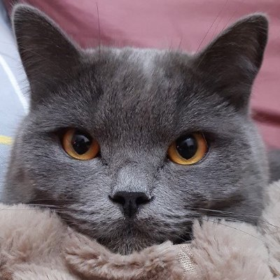

# Welcome to Huy Nguyen's Blog 👋

Hi there! I'm Huy, an open-source engineer passionate about contributing to the Flutter ecosystem and sharing knowledge with the community.

## Open to Work

I'm currently open to new opportunities, especially Flutter projects. I prefer open-source work and remote-first roles.

  <a class="cta-button" href="experiences/">See my experience</a>
  <a class="cta-button cta-button--secondary" href="files/Nguyen Quang Huy-Software Engineer.pdf" target="_blank" rel="noopener">View my CV</a>

## 📝 Highlighted Posts

- **[Fix a Flutter framework issue from scratch](posts/fix-a-flutter-framework-issue-from-scratch.md)** · *December 12, 2025*
- **[Compiling Flutter Engine Locally - Getting Started (Part I)](posts/compiling-flutter-engine-locally-part-i.md)** · *March 09, 2024*
- **[Bisecting regression issue in Flutter](posts/bisecting-regression-issue-in-flutter.md)** · *March 09, 2024*
- **[Introduction to NetShare - Flutter opensource project](posts/introduction-to-netshare-flutter-opensource-project.md)** · *March 09, 2024*

[View all posts →](posts.md)

## 🎤 Highlighted Talks

- **[Design Systems in Flutter: Today, Tomorrow, and Beyond](talks/design-systems-in-flutter-talk.md)** · *November 19, 2025*

[View all talks →](talks.md)

## What I Do

- 🔧 **Flutter Framework Contributor** - Used to work on issue-fixing and improvements for the Flutter framework Material widgets
- 📝 **Technical Writer** - Sharing insights about Flutter development, hacks, and tutorials
- 🎤 **Community Speaker** - Presenting at tech events
- 💻 **Open Source Developer** - Building and maintaining Flutter packages and projects

## Feedback

  <article class="feedback-card feedback-card--default feedback-card--codemagic is-active" role="listitem" tabindex="0">
    

      

        
      

      
Helina Ariva

    

    

      
<a class="feedback-card__link" href="https://www.linkedin.com/in/helina-ariva-1ab1a76b/" target="_blank" rel="noopener">Helina Ariva</a>

      

        
Project Manager &amp; Business Analyst

        Codemagic
      

      
"I've had the pleasure of working with Huy as his team lead. I've always admired his strong work ethic and attention to detail. Throughout his time on the team, Huy consistently demonstrated solid technical aptitude, strong debugging skills, and a thoughtful approach to problem-solving. He was always eager to take on new challenges, which enabled him to grow and progress across roles, from issue triage and verification to fixing the issues. Huy communicates clearly, collaborates with team members, and is easy to work with."

    

  </article>
  <article class="feedback-card feedback-card--codemagic" role="listitem" tabindex="0">
    

      

        
      

      
Taha

    

    

      
<a class="feedback-card__link" href="https://www.linkedin.com/in/tahatesser/" target="_blank" rel="noopener">Taha Tesser</a>

      

        
Kotlin Multiplatform Engineer

        DoorDash/Wolt
      

      
"Having worked with Huy for over three years, I can say he's one of the most technically solid and friendly engineers I've had the pleasure of collaborating with. He has a deep understanding of Flutter — not just as a user of the framework, but as an active contributor, fixing real issues that impact developers and end users alike. On top of that, he communicates clearly and is genuinely easy to work with. I'd recommend him without hesitation."

    

  </article>
  <article class="feedback-card feedback-card--codemagic" role="listitem" tabindex="0">
    

      

        
      

      
Kostia

    

    

      
<a class="feedback-card__link" href="https://www.linkedin.com/in/ksokolovskyi/" target="_blank" rel="noopener">Kostiantyn Sokolovskyi</a>

      

        
Open Source Engineer

        Codemagic
      

      
"I worked with Huy at Codemagic, where we collaborated on fixing Flutter issues. Huy demonstrated strong attention to detail and a thoughtful approach to problem-solving. He carefully investigated issues to identify root causes and focused on implementing reliable fixes. He was also responsive, communicated clearly in discussions and pull requests, and collaborated well with others. Working with him was productive and straightforward."

    

  </article>
  <article class="feedback-card feedback-card--google" role="listitem" tabindex="0">
    

      

        
      

      
Kate

    

    

      
<a class="feedback-card__link" href="https://www.linkedin.com/in/katelovettdeveloper/" target="_blank" rel="noopener">Kate Lovett</a>

      

        
Engineering Manager

        Google
      

      
"Huy has been an invaluable contributor to the Flutter ecosystem, demonstrating a deep commitment to accessibility and Material Design excellence. His impactful work ranges from fixing critical semantics issues across platforms to enhancing documentation and adding high-quality widget examples. Whether resolving subtle VoiceOver bugs or improving the diagnosticability of core styles, Huy's attention to detail and consistent dedication continues to improve Flutter's robustness and inclusivity."

    

  </article>
  <article class="feedback-card feedback-card--google" role="listitem" tabindex="0">
    

      

        
      

      
Justin

    

    

      
<a class="feedback-card__link" href="https://www.linkedin.com/in/justinmccandless/" target="_blank" rel="noopener">Justin McCandless</a>

      

        
Software Engineer

        Google
      

      
"Huy quickly went from submitting a few issue fixes to being a key part of Flutter's maintenance and development, proactively improving parts of the codebase and providing valuable insights to the team. He's the sort of engineer that can see the bigger picture of what he's working on and go beyond the task at hand. I wouldn't hesitate to work with him again in the future if given the chance."

    

  </article>
  <article class="feedback-card feedback-card--google" role="listitem" tabindex="0">
    

      

        
      

      
Qun

    

    

      
<a class="feedback-card__link" href="https://www.linkedin.com/in/qun-cheng/" target="_blank" rel="noopener">Qun Cheng</a>

      

        
Software Engineer

        Google
      

      
"Huy is an incredibly hardworking developer who is always willing to dive deep into complicated technical issues. We had a great time working together and contributing to the Flutter Material library; his dedication and focus on solving tough problems made him a fantastic partner in the development process."

    

  </article>

## Find Me Online

- **Email**: [huynguyennovem@gmail.com](mailto:[huynguyennovem@gmail.com])
- **GitHub (Contributor)**: [@huycozy](https://github.com/huycozy) - Flutter framework contributions
- **GitHub (Projects)**: [@huynguyennovem](https://github.com/huynguyennovem) - Open-source projects and plugins
- Socials:
    - [Twitter/X](https://twitter.com/huynguyentw)
    - [LinkedIn](https://www.linkedin.com/in/huynguyennovem/)

## Explore

- [📚 All Posts](posts.md) - Browse all my blog posts
- [🎯 Community Activities](community_activities.md) - My involvement in the tech community
- [📦 Projects & Packages](projects_packages.md) - Open-source projects I've built
- [🤝 Contributions](contributions.md) - My contributions to Flutter and other projects

---

*Thanks for visiting! Feel free to reach out if you have questions or want to collaborate on Flutter projects.*
