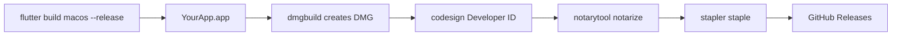

If you distribute a Flutter macOS app outside the Mac App Store (for example via GitHub Releases), users need a DMG that opens without Gatekeeper blocking it.

That means **Developer ID Application** signing plus **Apple notarization** — not a Mac App Store identity.

This tutorial is the flow I use while shipping [**NetShare**](https://github.com/huynguyennovem/netshare), built on the [`dmg`](https://pub.dev/packages/dmg) Dart package.

## Flow



## 1. One-time setup

### Tools

```sh
python3 -m pip install --user dmgbuild
xcode-select -p   # should point at Xcode.app
security find-identity -v -p codesigning | grep "Developer ID Application"
```

You need a cert like:

`Developer ID Application: Your Name (TEAMID)`

If it is missing: Xcode → Settings → Accounts → Manage Certificates → **Developer ID Application**.

### Notary profile (required for production)

1. Open [App Store Connect → Integrations → App Store Connect API](https://appstoreconnect.apple.com/access/integrations/api).
2. Create an API key (Admin), download the `.p8`, and note the **Issuer ID** and **Key ID**.
3. Store credentials in Keychain (prefer non-interactive flags so the path is not mistyped):

```sh
xcrun notarytool store-credentials "NotaryProfile" \
  --key "/path/to/AuthKey_XXXXXXXXXX.p8" \
  --key-id "XXXXXXXXXX" \
  --issuer "<Issuer-ID-UUID>"
```

The profile lives in Keychain. **Do not commit** the `.p8` file.

### Dev dependency

```sh
flutter pub add --dev dmg
```

## 2. Fix Xcode Release signing for the DMG path

Package `dmg` **re-signs** the `.app` with Developer ID after the Flutter build. Xcode only needs a successful local Release build.

Do **not** use Mac App Store identity for this flow:

- Avoid `3rd Party Mac Developer Application`
- Avoid a Mac App Store provisioning profile specifier
- Avoid `OTHER_CODE_SIGN_FLAGS = "--timestamp=none"` (that flag breaks notarization)

For the Runner **Release** config, use something like:

- `CODE_SIGN_STYLE = Automatic`
- `CODE_SIGN_IDENTITY = Apple Development`
- Your `DEVELOPMENT_TEAM` set

Then let `dmg` apply Developer ID + notarization.

## 3. Configure `dmg` in `pubspec.yaml`

```yaml
dmg:
  sign-certificate: "Developer ID Application: Your Name (TEAMID)"
  notary-profile: NotaryProfile
  build: true
  clean-build: true
  sign: true
  notarization: true
```

Replace the certificate string with the exact output from `security find-identity`.

## 4. Build the DMG

From the project root:

```sh
dart run dmg
```

This typically:

1. Cleans `build/macos` (if `clean-build: true`)
2. Runs `flutter build macos --release` (with obfuscation options when configured)
3. Signs the `.app` with Developer ID
4. Creates the DMG via `dmgbuild`
5. Signs the DMG
6. Submits notarization and waits
7. Staples the ticket onto the DMG

Output:

`build/macos/Build/Products/Release/<AppName>.dmg`

Useful flags:

```sh
# Local smoke test only (Gatekeeper will warn)
dart run dmg --no-sign --no-notarization

# Reuse an existing .app
dart run dmg --no-build --no-clean-build
```

## 5. Verify before you upload

```sh
APP="build/macos/Build/Products/Release/<AppName>.app"
DMG="build/macos/Build/Products/Release/<AppName>.dmg"

codesign -dv --verbose=4 "$APP"
codesign -dv --verbose=4 "$DMG"
spctl --assess --type open --context context:primary-signature -v "$DMG"
xcrun stapler validate "$DMG"
```

Expect Developer ID identity, a timestamp, `spctl` accepted, and stapler OK.

Then copy the DMG to another Mac (or a VM), install the app, and smoke-test the main features.

## 6. Publish

1. Rename for clarity, e.g. `YourApp-1.2.3.dmg`.
2. Upload to GitHub Releases with your other platform artifacts.
3. If you used Dart obfuscation, keep `debug-macos-info/` for crash symbolication — **do not** ship it inside the DMG.

## Troubleshooting

**`notarytool`: “The file couldn’t be opened”**

Usually a bad path from the interactive prompt (extra spaces/quotes) or quarantine on a downloaded `.p8`. Prefer the non-interactive `store-credentials` command above. If needed:

```sh
xattr -d com.apple.quarantine "/path/to/AuthKey_XXXXXXXXXX.p8"
```

**Signing / notarization fails after a “successful” Flutter build**

Check that Release is not still on a Mac App Store identity or `--timestamp=none`.

**Never commit secrets**

Keep `.p8` files and Issuer IDs out of git. Only the Keychain profile name (`NotaryProfile`) belongs in `pubspec.yaml`.

## Built from real experience: NetShare

I wrote this guide from the macOS release workflow for **NetShare**.
If you want to see a real Flutter desktop app shipped this way, check the repo and releases 👉 [github.com/huynguyennovem/netshare](https://github.com/huynguyennovem/netshare)

That's all! Happy shipping!
