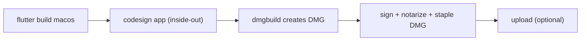

When I started shipping [**NetShare**](https://github.com/huynguyennovem/netshare) outside the Mac App Store, I assumed the hard part would be the Flutter side. It wasn't. The hard part was getting a DMG that a stranger can download, double-click, and open without macOS throwing a scary "cannot be verified" dialog at them.

To get there you need two things: **Developer ID Application** signing and **Apple notarization**. A Mac App Store identity won't do the job here.

My first version of the release flow was a single command, `dart run dmg`. It worked... until it didn't. So this post covers both: the one-liner, why I eventually moved away from it, and the small set of shell scripts I use today.

## The flow



Five steps, one orchestrator script that calls the others. Each step can also run on its own, which turns out to matter a lot when something fails at 90%.

## 1. One-time setup

### Tools

```sh
python3 -m pip install --user dmgbuild
xcode-select -p   # should point at Xcode.app
security find-identity -v -p codesigning | grep "Developer ID Application"
```

You're looking for a certificate that reads like this:

`Developer ID Application: Your Name (TEAMID)`

If it's missing, open Xcode → Settings → Accounts → Manage Certificates and create a **Developer ID Application** certificate.

### A notary profile in Keychain

Notarization needs credentials, and I prefer to keep them in Keychain instead of passing them around in scripts.

1. Go to [App Store Connect → Integrations → App Store Connect API](https://appstoreconnect.apple.com/access/integrations/api).
2. Create an API key, download the `.p8` file, and write down the **Issuer ID** and **Key ID**.
3. Store them as a named profile:

```sh
xcrun notarytool store-credentials "NotaryProfile" \
  --key "/path/to/AuthKey_XXXXXXXXXX.p8" \
  --key-id "XXXXXXXXXX" \
  --issuer "<Issuer-ID-UUID>"
```

From now on every script only needs the profile name, `NotaryProfile`. The `.p8` file itself never goes into git.

### The `dmg` package

```sh
flutter pub add --dev dmg
```

## 2. Don't let Xcode sign for the Mac App Store

Whatever signs the `.app` at the end of the day will be our scripts, so Xcode only needs to produce a clean Release build. A few things will quietly break notarization if they're set in the Runner's Release configuration:

- A `3rd Party Mac Developer Application` identity
- A Mac App Store provisioning profile
- `OTHER_CODE_SIGN_FLAGS = "--timestamp=none"`

I keep Release on `Apple Development` with automatic signing and my team set. Developer ID gets applied later.

## 3. Configure `dmg` to only package

Here's the part that differs from most tutorials. The `dmg` package can build, sign and notarize in one go, but I only use it for the packaging step. Everything else is switched off in `pubspec.yaml`:

```yaml
dmg:
  sign-certificate: "Developer ID Application: Your Name (TEAMID)"
  notary-profile: NotaryProfile
  build: false
  clean-build: false
  sign: false
  notarization: false
```

## 4. Why I stopped using `dart run dmg` to sign

The one-liner signs the app with `codesign --deep`. It looks convenient, but it has two problems:

- Apple recommends signing nested code first and the container last, not letting `--deep` figure out the order.
- Every signature asks Apple's timestamp server for a timestamp. When that service is slow or unreachable, `codesign` fails with `A timestamp was expected but was not found`, usually halfway through some nested dylib. A Flutter app has plenty of those.

After the third or fourth failed release attempt, I took signing out of the package and wrote it myself.

## 5. The scripts

Everything lives in `scripts/macos/` and runs from the project root.

### A retry wrapper for `codesign`

A small shared library does one job: run `codesign`, and if the timestamp error shows up, wait and try again with a growing delay.

```sh
CODESIGN_IDENTITY="${CODESIGN_IDENTITY:-Developer ID Application: Your Name (TEAMID)}"
NOTARY_PROFILE="${NOTARY_PROFILE:-NotaryProfile}"
CODESIGN_MAX_ATTEMPTS="${CODESIGN_MAX_ATTEMPTS:-8}"

codesign_with_retry() {
  local attempt=1 delay=2 output status=0

  while (( attempt <= CODESIGN_MAX_ATTEMPTS )); do
    output="$(/usr/bin/codesign "$@" 2>&1)" && status=0 || status=$?
    if (( status == 0 )); then
      [[ -n "$output" ]] && printf '%s\n' "$output"
      return 0
    fi
    [[ -n "$output" ]] && printf '%s\n' "$output" >&2

    if [[ "$output" == *"timestamp was expected but was not found"* ]] &&
      (( attempt < CODESIGN_MAX_ATTEMPTS )); then
      echo "timestamp failed (attempt ${attempt}); retrying in ${delay}s..." >&2
      sleep "$delay"
      delay=$(( delay * 2 > 15 ? 15 : delay * 2 ))
      attempt=$((attempt + 1))
      continue
    fi
    return "$status"
  done
  return "$status"
}
```

The delay goes 2, 4, 8 seconds and then caps at 15. Any other kind of error fails immediately, since retrying a real signing problem just wastes time.

### Sign the app, inside-out

```sh
while IFS= read -r -d '' item; do
  [[ "$item" == "$APP_PATH" ]] && continue
  codesign_with_retry --force --options runtime --timestamp \
    --sign "$CODESIGN_IDENTITY" -- "$item"
done < <(
  find "$APP_PATH/Contents" -depth \( \
    -name '*.dylib' -o -name '*.framework' -o -name '*.bundle' \
    -o -name '*.xpc' -o -name '*.appex' \
  \) -print0
)

codesign_with_retry --force --options runtime --timestamp \
  --entitlements "$ENTITLEMENTS" \
  --sign "$CODESIGN_IDENTITY" -- "$APP_PATH"

codesign --verify --verbose=2 "$APP_PATH"
```

`find -depth` lists the deepest items first, so leaf libraries get signed before the frameworks that contain them. The `.app` goes last, together with its entitlements. The hardened runtime (`--options runtime`) is mandatory, because notarization rejects anything without it.

### Sign, notarize and staple the DMG

```sh
codesign_with_retry --force --timestamp --options runtime \
  --sign "$CODESIGN_IDENTITY" -- "$DMG_PATH"

xcrun notarytool submit "$DMG_PATH" \
  --keychain-profile "$NOTARY_PROFILE" \
  --wait

xcrun stapler staple "$DMG_PATH"
xcrun stapler validate "$DMG_PATH"
```

`--wait` blocks until Apple finishes, which usually takes a few minutes. Stapling attaches the notarization ticket to the DMG itself, so it still opens cleanly when the user is offline.

### One script to rule them all

The orchestrator simply runs everything in order and stops on the first error:

```sh
set -euo pipefail

flutter build macos --release \
  --obfuscate \
  --split-debug-info=./build/debug-macos-info

./scripts/macos/codesign_macos_app.sh "$APP_PATH"

dart run dmg --no-build --no-sign --no-notarization

./scripts/macos/notarize_macos_dmg.sh "$DMG_PATH"

./scripts/macos/upload_dmg_r2.sh   # optional
```

The result lands in `build/macos/Build/Products/Release/<AppName>.dmg`. I also wired it to an IntelliJ run configuration, so a release is one click.

If the app is already built and signed, there's no need to start over. Run only what's left:

```sh
dart run dmg --no-build --no-sign --no-notarization
./scripts/macos/notarize_macos_dmg.sh
```

## 6. Verify before you ship

Don't trust the green output, check it:

```sh
codesign -dv --verbose=4 "$APP"
codesign -dv --verbose=4 "$DMG"
spctl --assess --type open --context context:primary-signature -v "$DMG"
xcrun stapler validate "$DMG"
```

You want a Developer ID authority, a timestamp, `spctl` saying *accepted*, and stapler saying the ticket is valid. Then copy the DMG to another Mac (a VM works too), install the app, and click around. A build that passes every check can still crash on launch because of a missing entitlement, and you only find out on a clean machine.

## 7. Optional: upload to Cloudflare R2

For hosting the DMG I use Cloudflare R2. It speaks the S3 API, so a few lines of `boto3` are enough:

```python
client = boto3.client(
    "s3",
    endpoint_url=f"https://{account_id}.r2.cloudflarestorage.com",
    aws_access_key_id=access_key_id,
    aws_secret_access_key=secret_access_key,
    region_name="auto",
    config=Config(signature_version="s3v4", s3={"addressing_style": "path"}),
)

client.put_object(
    Bucket=bucket,
    Key="releases/macos/NetShare.dmg",
    Body=body,
    ContentType="application/x-apple-diskimage",
    CacheControl="public, max-age=300",
)
```

Two details that cost me some time:

- Newer boto3 versions compute extra checksums by default, which can hang or fail against R2. Setting `AWS_REQUEST_CHECKSUM_CALCULATION=when_required` and `AWS_RESPONSE_CHECKSUM_VALIDATION=when_required` fixes it.
- The account ID, keys and bucket name come from a git-ignored `.env.r2` file, never from the script. Mine is a copy of an example file that only lists the variable names.

If you'd rather keep things simple, GitHub Releases works just as well. Rename the file to something like `YourApp-1.2.3.dmg` and attach it.

One more thing: if you build with `--obfuscate`, keep the `--split-debug-info` output somewhere safe. You'll need it to read crash stack traces. It does not belong inside the DMG.

## Troubleshooting

**`A timestamp was expected but was not found`**

Apple's timestamp service is flaky. The retry wrapper handles most cases. If it still fails repeatedly even though `timestamp.apple.com` is reachable, switch networks or turn on a VPN, then re-run only the app signing script.

**`notarytool`: "The file couldn't be opened"**

Usually a mistyped path from the interactive prompt, or a quarantine flag on a downloaded `.p8`. Use the non-interactive `store-credentials` command above, and if needed:

```sh
xattr -d com.apple.quarantine "/path/to/AuthKey_XXXXXXXXXX.p8"
```

**Never commit secrets**

`.p8` files, Issuer IDs, access keys and `.env` files stay out of git. The only thing that belongs in the repo is the Keychain profile name.

## Wrapping up

None of these steps is hard on its own. The pain comes from the pieces failing in ways that look unrelated, like a timestamp server outage breaking your release at the last dylib. Splitting the flow into small scripts that can be re-run independently made releases boring again, which is exactly what I want from a release process.

You can see the whole thing in action in [NetShare](https://netfshare.site/).

That's all! Happy shipping!
